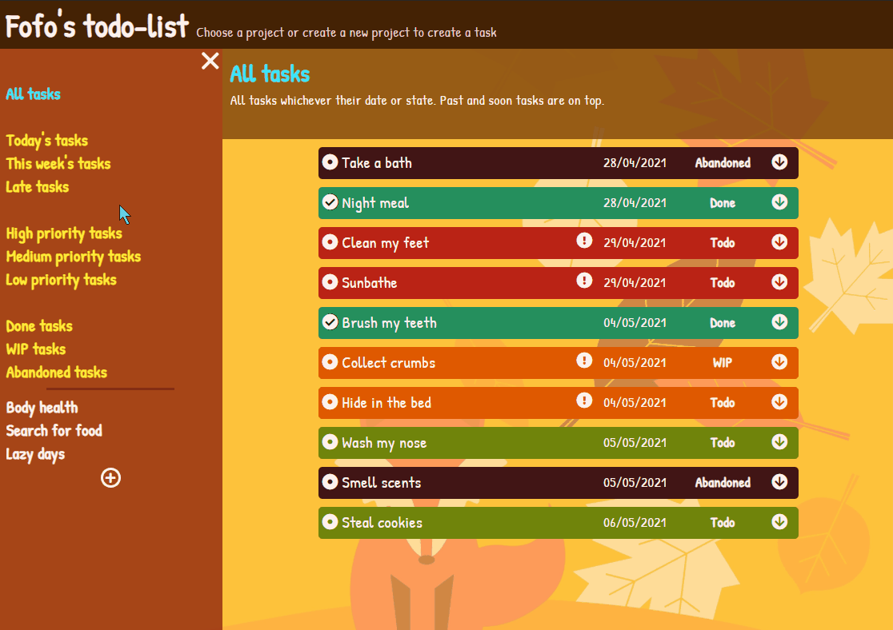
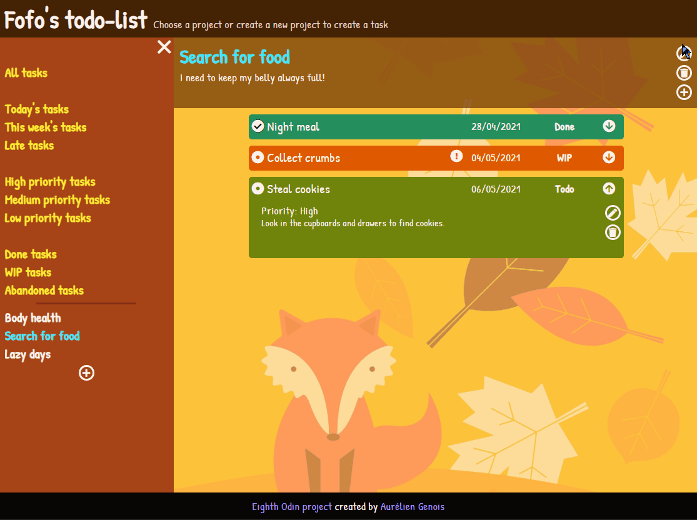
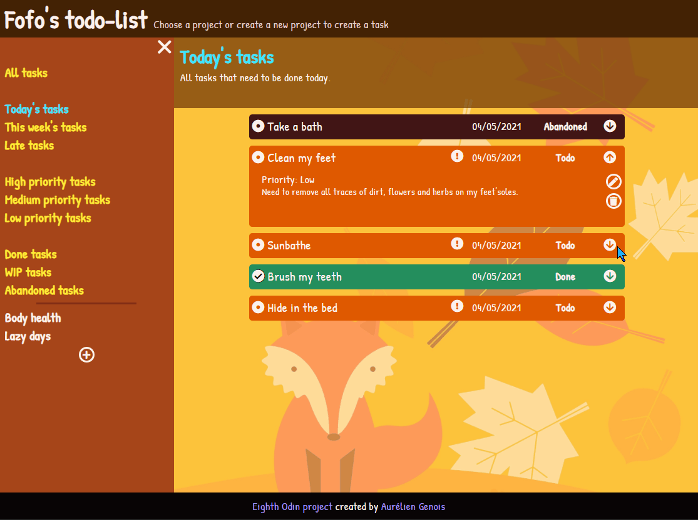
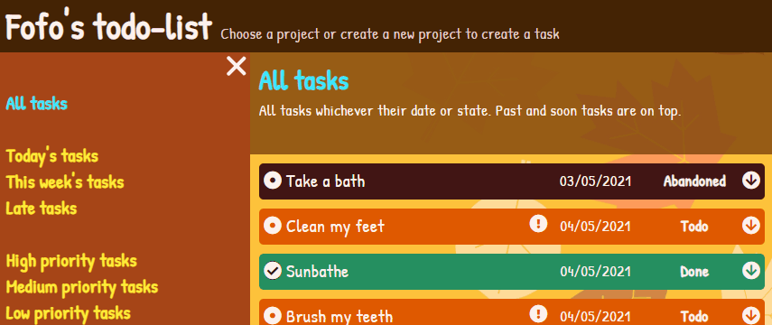

# todo-list

<h2 align="center"><a  href="https://aurelien-genois.github.io/todo-list/">Live Demo</a></h2>

## Description
The [eighth Odin project](https://www.theodinproject.com/paths/full-stack-javascript/courses/javascript/lessons/todo-list) is a simple todo-list application for practice JavaScript and apply OOP Principles.

## Features

- Can see all tasks from all projects
- Can display only today's tasks, this week's tasks or late tasks
- Can display high/medium/low priority tasks
- Can display done/WIP/abandoned tasks
- Can display a project's tasks
- Can create a new project
- Can create a new task

  
  

- Can edit a project
- Can edit a task
- Can delete a project
- Can delete a task
- A confirm message asks for confirmation before deleting a project/task
- Cannot edit several tasks at the same times, a alert informs the user if he tries

  
  

- Can open a task details
- Can check a task state ('Done') or uncheck it ('Todo')
- Task details are stills opened when toggle check state and delete a task
- Projects and tasks are saved in the LocalStorage
- Color and icons with tooltips (for today and late tasks) informs on the current task's state

## Challenges
This project's goal is to review and pratice OOP by applying its important principles (single responsability, loosely coupled objects, SOLID principles), so this bring me to think deeply how to organize methods and modules.

A second goal was to use external modules with webpack like Babel and date-fn for manipulate dates and manage their format.

I implemented two popups forms for project/task creation (by mixing JS, CSS and HTML) and two "in-place" forms for project/task editing (by matching the same layout).

For a better mobile UI, I implemented a collapsible tabs menu for small width screens, with a button to open and close it, animated with CSS (burger shape to cross shape).

